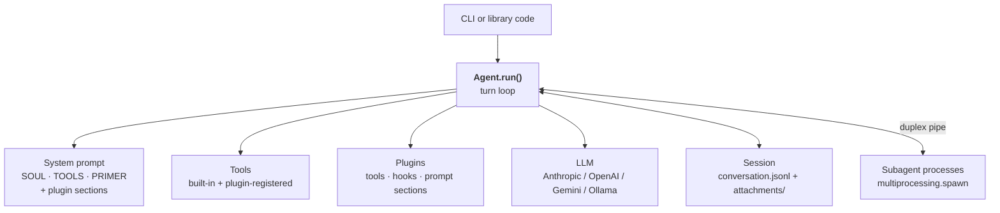
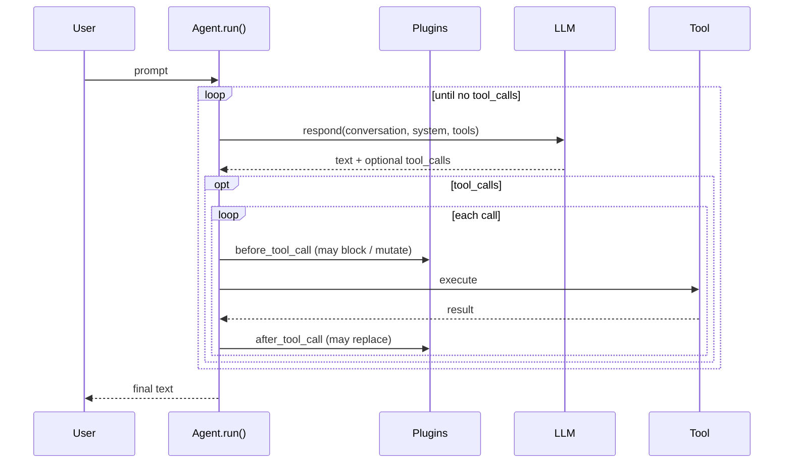
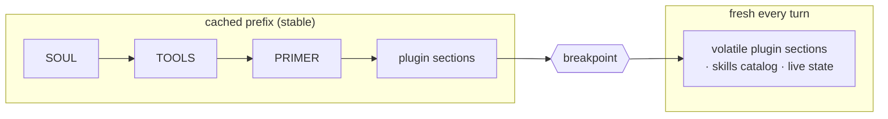

# Architecture

Three diagrams. See [design.md](design.md) for more detail.

## System overview

Notes:

- Subagents are separate OS processes, not threads. Parent and child
  talk over a duplex pipe carrying the event protocol in
  [`pyagent/protocol.py`](../pyagent/protocol.py).
- Anthropic, OpenAI, and Gemini ship as built-in clients in
  `pyagent.llms`. Ollama is added by a bundled plugin via
  `api.register_provider("ollama", ...)`. Third-party plugins can
  register providers the same way.
- The permissions gate only covers the built-in filesystem and shell
  tools. Plugin tools and your own `add_tool`s don't go through it
  unless they call it themselves.

## The turn cycle

Notes:

- `before_tool_call` fires before the permissions prompt, so a plugin
  can block a call before the human is asked to approve it.
- The plugin set is rescanned at the top of every turn. A plugin the
  agent just authored (via the `write-plugin` skill) is callable on
  its next turn without restarting.

## System prompt assembly

The prefix is cached by the provider; anything past the breakpoint is
sent fresh each turn. Plugin prompt sections pick a side via
`volatile=True/False` on `register_prompt_section`. Anything that
changes turn-to-turn (memory recall, skills catalog, live checklist)
goes on the volatile side so it doesn't invalidate the cached prefix.

---

See [design.md](design.md) for more detail and
[plugin-design.md](plugin-design.md) for the plugin author API.
