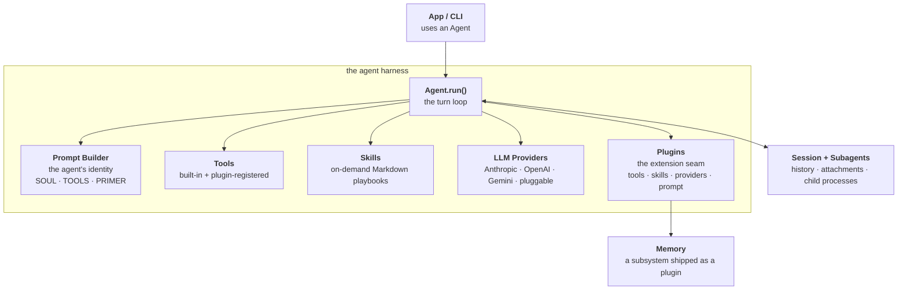
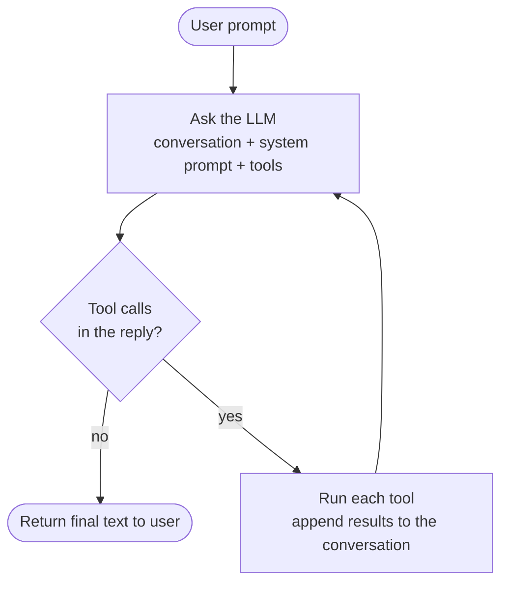
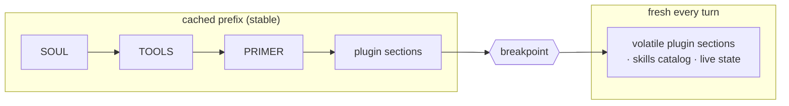

# Architecture

Three diagrams. See [design.md](design.md) for more detail.

## System overview

Notes:

- The "agent harness" is the framework itself: the turn loop plus the
  five things it composes — prompt builder, tools, skills, LLM
  providers, and the plugin system. An App or CLI just constructs an
  `Agent` and calls `run()`.
- Plugins are the extension seam (`PluginAPI`). They register tools and
  LLM providers, contribute system-prompt sections, and observe or
  control the turn loop. Big subsystems ship this way — memory
  (markdown ledgers + fastembed vector recall) is a bundled plugin,
  not core.
- Anthropic, OpenAI, and Gemini ship as built-in providers in
  `pyagent.llms`. Ollama is added by a bundled plugin via
  `api.register_provider("ollama", ...)`. Third-party plugins register
  providers the same way.
- Tools are callable functions the LLM invokes; skills are passive
  markdown playbooks the agent pulls in on demand (`read_skill`). Both
  come in built-in and plugin/user-provided flavors.
- "Session + subagents" is the runtime state layer: conversation
  history and attachments on disk, plus child agents spawned via
  `multiprocessing.spawn` talking over a duplex pipe carrying the event
  protocol in [`pyagent/protocol.py`](../pyagent/protocol.py).
- The permissions gate only covers the built-in filesystem and shell
  tools. Plugin tools and your own `add_tool`s don't go through it
  unless they call it themselves.

## The agent loop

That is the whole loop: ask the LLM, and if it asked for tools, run
them and ask again — otherwise you're done. The `Run → Ask` edge is
the loop.

Notes — the essentials happen above; a few things happen *around* the
loop and aren't drawn:

- At the top of every turn the plugin set is rescanned and the system
  prompt is rebuilt. A plugin the agent just authored (via the
  `write-plugin` skill) is callable on its next turn without
  restarting.
- Each tool call passes through plugin hooks: `before_tool_call` (may
  block or mutate) and `after_tool_call` (may replace the result).
- `before_tool_call` fires before the permissions prompt, so a plugin
  can block a call before the human is asked to approve it.

## System prompt assembly

The prefix is cached by the provider; anything past the breakpoint is
sent fresh each turn. Plugin prompt sections pick a side via
`volatile=True/False` on `register_prompt_section`. Anything that
changes turn-to-turn (memory recall, skills catalog, live checklist)
goes on the volatile side so it doesn't invalidate the cached prefix.

---

See [design.md](design.md) for more detail and
[plugin-design.md](plugin-design.md) for the plugin author API.
